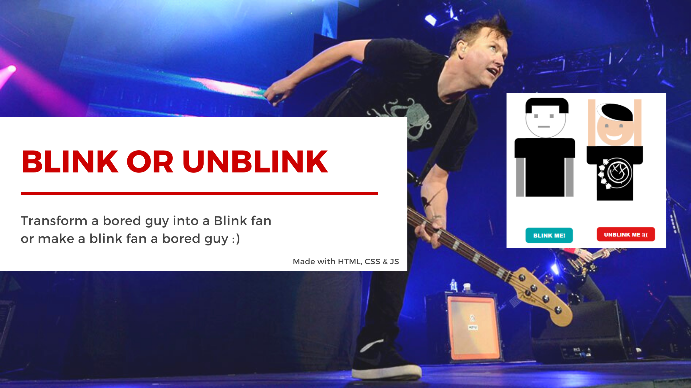

# Blink Guy

**Made with:**<br/>
HTML, CSS e JS
<br/><br/>
**What is this?**<br/>
It's a page with a guy, made with CSS and JS, that blinks182 when you click on the buttons :)

# Quick links &#128150;
  
[PROJECT SETUP](#Project-setup) &diams; [PREVIEW](#Preview) &diams; [STATUS OF THE PROJECT](#How-is-the-development-of-the-project-right-now) &diams; [CREDITS](#Credits) &diams; [BACK TO TOP](#Blink-Guy)

# Project setup
```
Open on your favorite browser ;)
```

**Thank you for your support!**

# Preview


# How is the development of the project right now?
**Last update:** 03/02/2024

After 3 years, I refactored the code hahaha

# Credits

- Blink 182 logo: got it from from Google :)
- Banner img bg was from this site: https://allpunkedup.com/heres-how-to-live-stream-a-blink-182-concert-this-weekend/
  
[PROJECT SETUP](#Project-setup) &diams; [PREVIEW](#Preview) &diams; [STATUS OF THE PROJECT](#How-is-the-development-of-the-project-right-now) &diams; [CREDITS](#Credits) &diams; [BACK TO TOP](#Blink-Guy)
